# Match Point

## Overview

Match Point is a Flutter football companion app built with Firebase,
API-Football, Dio, GoRouter, and BLoC. Users can authenticate, browse fixtures,
filter results, search teams or competitions, and manage their profile through a
focused, responsive Material 3 interface.

## Screenshots

<p align="center">
	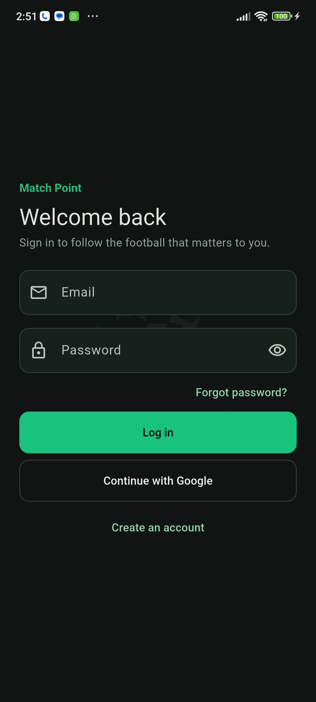
	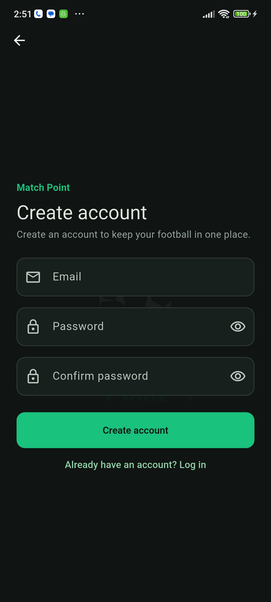
	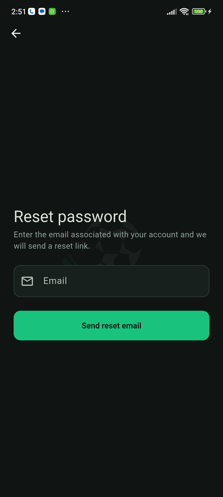
</p>

<p align="center">
	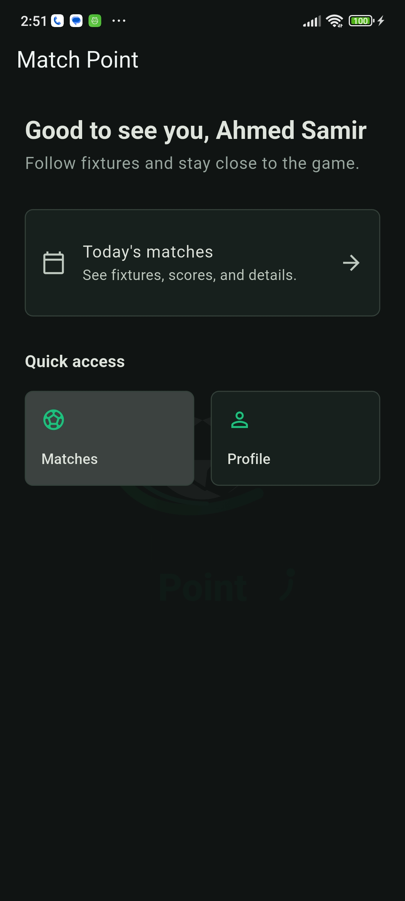
	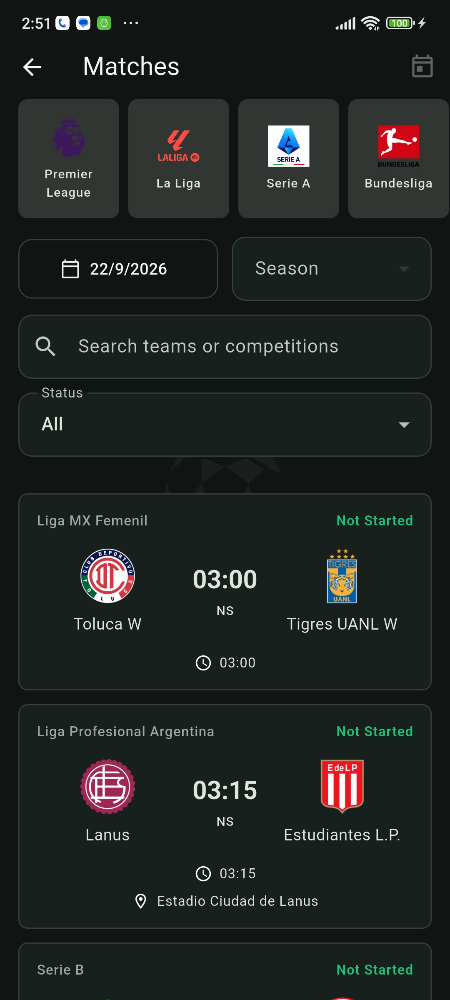
	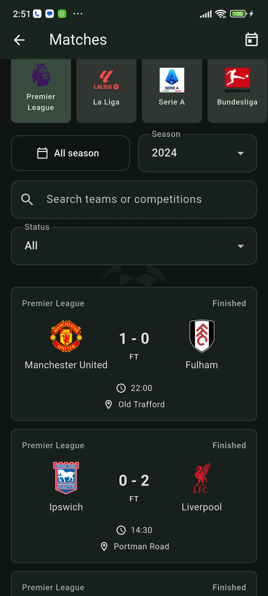
</p>

<p align="center">
	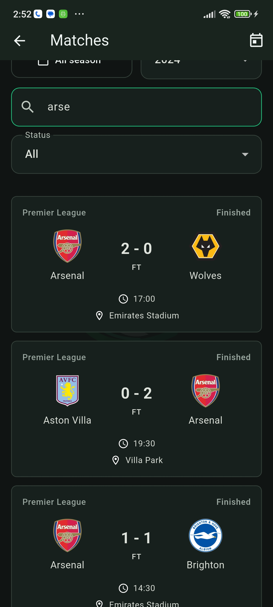
	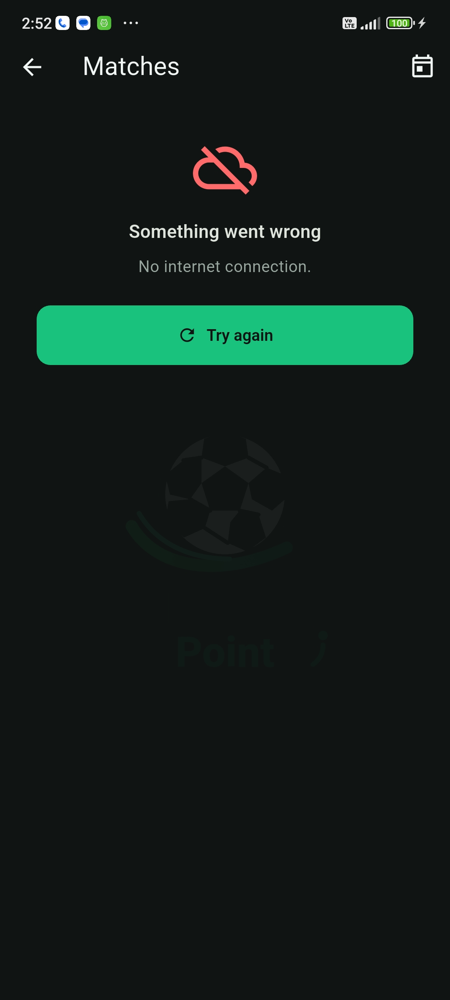
</p>

For a detailed walkthrough of the architecture, layers, network flow, error
handling, and navigation guard, see [Architecture Guide](docs/architecture.md).

## Architecture

The project is **feature-first** and follows **separation of concerns**. The
application entry points compose the app, `core/` contains shared infrastructure,
and each feature keeps its presentation, logic, and data code together. This
makes the codebase easier to navigate, test, and extend without coupling one
feature to another.

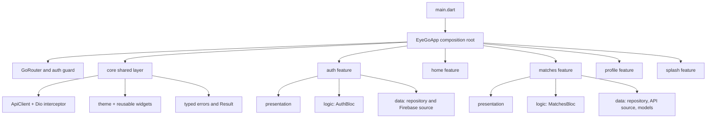

### Project Structure

```text
lib/
│
├── main.dart                  # Application entry point
├── app.dart                   # App composition and dependency injection
├── firebase_options.dart      # Firebase platform configuration
│
├── core/                      # Shared, feature-independent code
│   ├── config/                # Environment and app configuration
│   ├── constants/             # API, date, and route constants
│   ├── errors/                # Exceptions, failures, and mappers
│   ├── network/               # Dio API client and interceptor
│   ├── routes/                # GoRouter and authentication redirects
│   ├── theme/                 # Colors, spacing, radius, and app theme
│   ├── utils/                 # Result, validators, dates, and snackbars
│   └── widgets/               # Reusable app-level UI components
│
└── features/                  # Feature-specific vertical slices
    ├── auth/                  # Firebase authentication
    ├── home/                  # Authenticated landing screen
    ├── matches/               # Fixture browsing and filtering
    ├── profile/               # Authenticated user profile
    └── splash/                # Authentication-resolution loading screen
```

The separation can be understood as three responsibilities within each feature:

- **Presentation** renders the UI, collects input, dispatches BLoC events, and
  shows loading, empty, error, and success states.
- **Logic** contains BLoCs, handles user-intent events, coordinates requests,
  and emits immutable states without knowing widget layout details.
- **Data** contains repository contracts and implementations, remote data
  sources, models, and the integration details for Firebase or API-Football.

Shared code belongs in `core/` only when it is independent of a particular
feature. Features may depend on `core/`, but `core/` must not depend on a
feature. This keeps dependencies flowing in one direction and prevents UI,
networking, and authentication details from being mixed together.

### Layer Responsibilities

| Layer | Responsibility | Must not do |
| --- | --- | --- |
| `presentation/` | Render state, collect input, dispatch events, show feedback | Call Firebase, Dio, or parse API JSON |
| `logic/` | Handle BLoC events, coordinate use cases, emit immutable states | Know Flutter widget layout details |
| `data/` | Define repository contracts, call remote sources, return `Result` | Contain screen-specific UI state |
| `core/` | Share configuration, routing, network client, errors, theme, widgets, and utilities | Depend on a particular feature |

## Data, Logic, and Presentation

The presentation layer talks only to a BLoC. The BLoC depends on an abstract
repository contract. The repository owns error conversion, and the remote data
source owns external SDK or HTTP details.

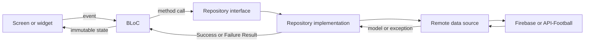

### Fixture Request Flow

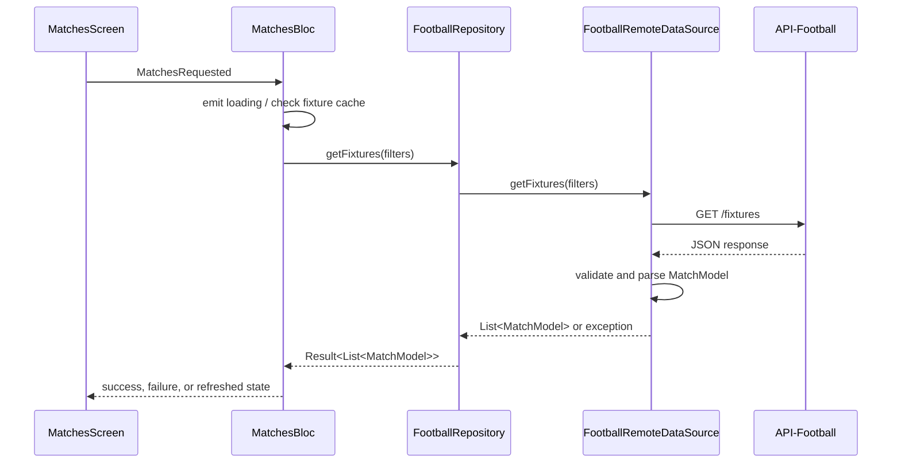

### Remote Data Sources

`FootballRemoteDataSourceImpl` builds fixture query parameters, calls the
shared `ApiClient`, validates API-level errors, and converts the response to
`MatchModel` objects. It does not decide how a screen displays failures.

`FirebaseAuthRemoteDataSource` is the Firebase SDK adapter. It exposes the
auth-state stream and performs email/password, Google, password-reset, and
sign-out operations. The repository maps its SDK exceptions into application
failures before a BLoC sees them.

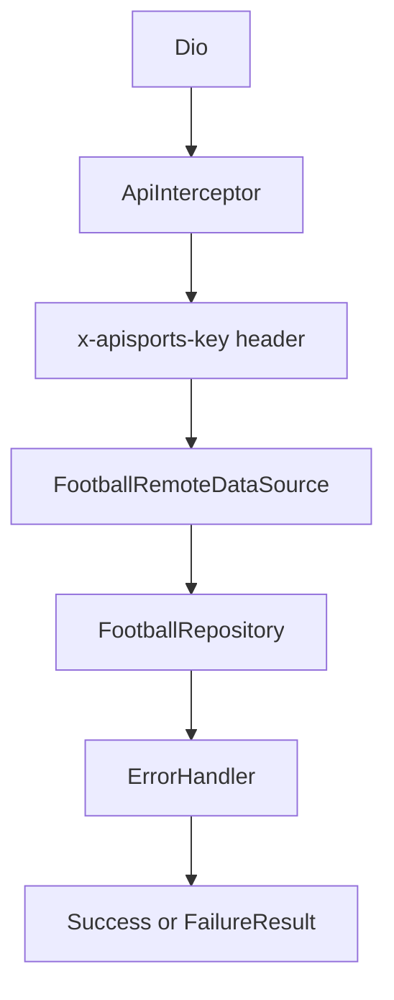

## State Management

`flutter_bloc` manages feature state. Events express user intent; states
describe what the UI can render. This keeps filtering and asynchronous work out
of widgets.

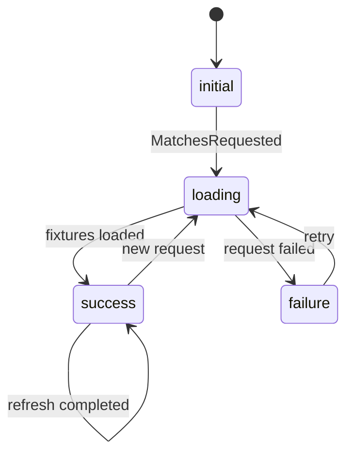

`MatchesBloc` keeps a fixture cache keyed by request parameters and performs
search, competition, and status filtering in memory. `MatchesState` keeps both
the unfiltered source list and the filtered list so the UI stays simple.

## Navigation and Authentication

`AppRouter` listens to `AuthBloc` through a refresh notifier. The splash route
is intentionally retained while Firebase resolves the current session, which
prevents a momentary redirect to the wrong screen.

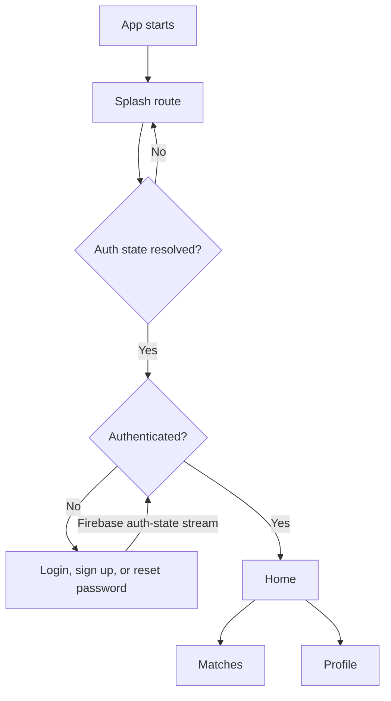

## Patterns Used

| Pattern | Where it is used | Why it is useful |
| --- | --- | --- |
| Feature-first organization | `features/` | Keeps related presentation, logic, and data close together |
| BLoC | `AuthBloc`, `MatchesBloc` | Separates user interaction/state transitions from widgets |
| Repository | `AuthRepository`, `FootballRepository` | Gives logic a stable, testable data contract |
| Remote data source / adapter | Firebase and API-Football sources | Isolates SDK and HTTP implementation details |
| Dependency injection by composition | `EyeGoApp` providers | Supplies dependencies from one explicit application root |
| Result type | `Success` / `FailureResult` | Makes expected data failures explicit instead of leaking exceptions |
| Factory parsing | `MatchModel.fromJson` | Keeps API JSON transformation inside model construction |

## Features

### Authentication

- Email/password sign in and account creation.
- Google sign in on supported non-web platforms.
- Password reset email and sign out.
- Persistent session through Firebase's auth-state stream.
- Local UI concerns, such as password visibility and keyboard dismissal, stay
  in presentation rather than the BLoC.

### Matches

- Fetches API-Football fixtures through Dio.
- Supports quick competition selection, date selection, season selection,
  team/league search, and match-status filtering.
- Handles loading, empty, error, retry, and pull-to-refresh states.
- Displays team logos with a safe football-icon fallback.

### Home

- Provides a compact authenticated landing page.
- Offers direct navigation to fixtures and profile without artificial data.

### Profile

- Shows the Firebase user's display name, email, and photo when available.
- Provides a clearly styled sign-out action.

### Splash

- Holds the initial route while authentication resolves.
- Shows a branded loading state instead of exposing transient routing state.

### Standings

- The feature folders are reserved for future standings data, BLoC, and UI.
- No standings behavior is implemented yet.

## UI System

The app uses a dark football-oriented Material 3 theme. Shared colors, spacing,
radius, and dimension tokens live in `core/theme`. Reusable controls and views
such as `AppButton`, `AppTextField`, `AppEmptyView`, and `AppErrorView` keep
common states visually consistent across features.

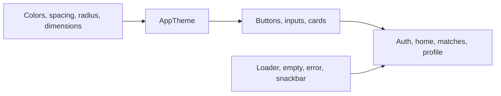

## Architecture Decision Record

These decisions are ordered by when they shaped the project during
implementation. They explain why the current structure exists, not just what
files are present.

| ADR | Decision | Why | Result |
| --- | --- | --- | --- |
| ADR-001 | Use feature-first folders with a small shared `core/` layer. | Grouping by feature keeps a capability's UI, state, and data close together while avoiding a single, large screen/model folder. | Features can evolve independently; shared infrastructure remains reusable and feature-independent. |
| ADR-002 | Use BLoC for feature state and events. | Asynchronous authentication, fixtures, filtering, and refresh behavior should not live in widgets. | Screens react to immutable states and dispatch intent-focused events. |
| ADR-003 | Add repository contracts and remote data sources. | BLoCs should not know Firebase SDK calls, Dio configuration, endpoints, or JSON details. | Logic depends on testable interfaces; external integrations are isolated behind repositories and source adapters. |
| ADR-004 | Return `Success` and `FailureResult` from repositories. | Technical exceptions need a predictable representation before reaching BLoCs and UI. | Central error mappers translate Dio and Firebase failures into user-facing states. |
| ADR-005 | Make Firebase auth state the source of truth for navigation. | Manually navigating after each login or logout would duplicate rules and create route race conditions. | `AuthBloc` observes Firebase and GoRouter centrally redirects protected and auth-only routes. |
| ADR-006 | Keep Splash while the initial auth state resolves. | The router cannot safely choose Home or Login until Firebase reports the persisted session. | The app avoids a transient incorrect route and shows a branded loading state. |
| ADR-007 | Cache fixture requests and filter loaded matches locally. | Search and status changes should feel immediate and should not consume API-Football quota. | `MatchesBloc` caches by request parameters and derives `filteredMatches` from loaded fixtures. |
| ADR-008 | Create a shared Material 3 design system and reusable state views. | Styling and loading/error/empty states should not be reinvented per screen. | Theme tokens and shared widgets give auth, home, matches, and profile a consistent responsive UI. |


## Setup

### Prerequisites

- Flutter SDK compatible with the version in `pubspec.yaml`.
- A Firebase project configured for the desired platforms.
- An API-Football key.

### Environment

Create a `.env` file in the project root:

```env
API_FOOTBALL_BASE_URL=https://v3.football.api-sports.io
API_FOOTBALL_KEY=your_api_key
```

Firebase options are loaded from `lib/firebase_options.dart`. Do not commit
private environment values.

### Run

```bash
flutter pub get
flutter analyze
flutter test
flutter run
```

## Verification

Widget tests cover the splash route and authenticated Home-to-Profile
navigation. Static analysis is run with `flutter analyze`.

For help getting started with Flutter development, view the
[online documentation](https://docs.flutter.dev/), which offers tutorials,
samples, guidance on mobile development, and a full API reference.
