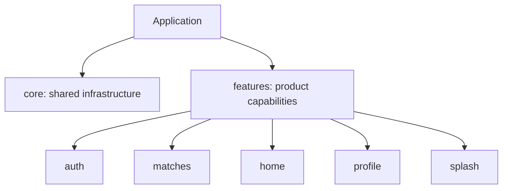
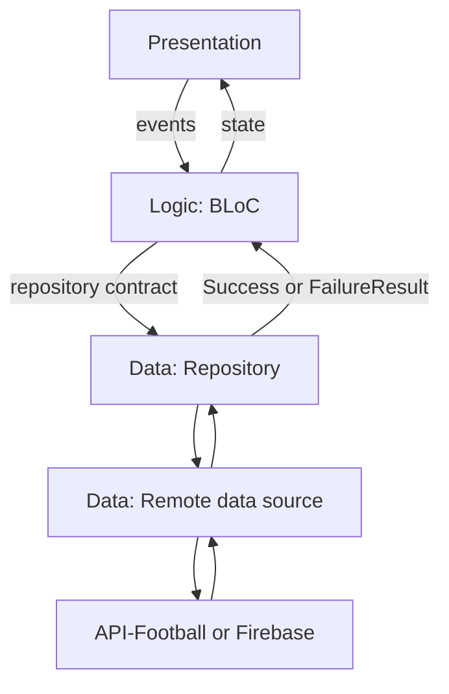
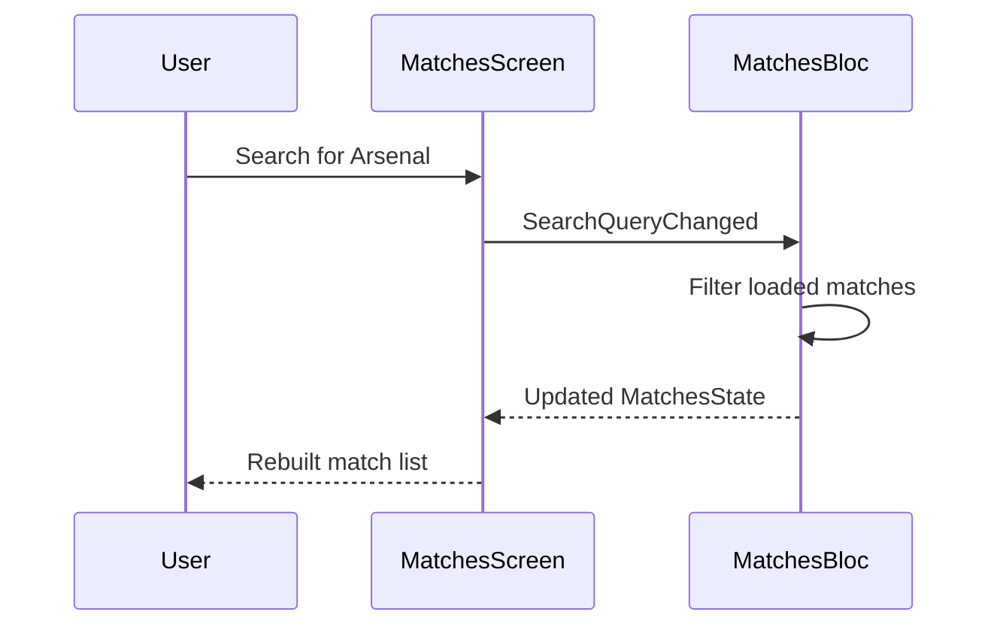
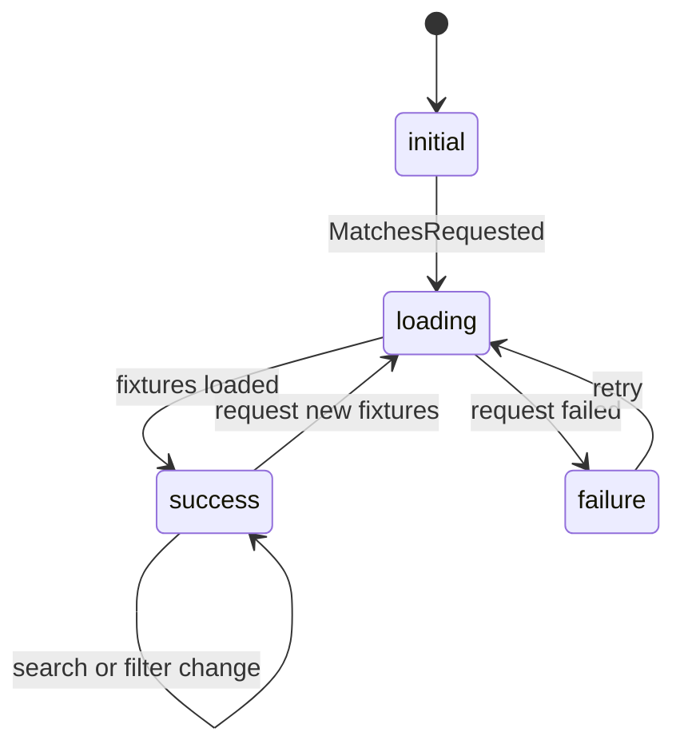
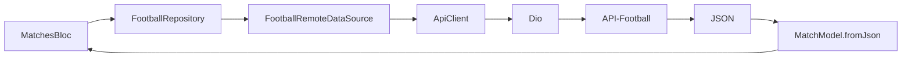
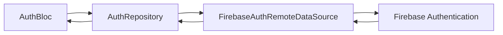
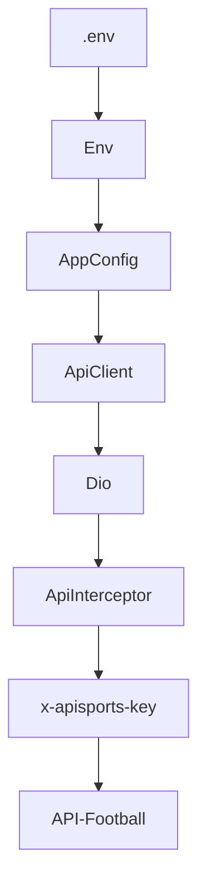
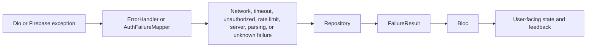
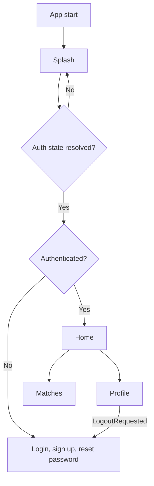

# Architecture Guide

## Project Structure

Match Point follows a **feature-first architecture** with a lightweight layered
approach. Features own the code for a product capability, while `core/` owns
cross-feature infrastructure and reusable UI.

```text
lib/
  main.dart
  app.dart
  firebase_options.dart
  core/
    config/ constants/ errors/ network/ routes/ theme/ utils/ widgets/
  features/
    auth/ home/ matches/ profile/ splash/ standings/
```



This organization keeps unrelated capabilities decoupled and makes it easy to
find the code that owns a behavior.

## Feature Layers

Complex features use three local layers:

```text
feature/
  data/           # Models, repository, remote data source
  logic/          # BLoC, events, states
  presentation/   # Screens and feature-only widgets
```



### Presentation

`presentation/` contains screens and widgets. It renders loading, success,
empty, and error states; collects user input; sends BLoC events; and displays
UI feedback. It does not call Firebase, Dio, or API-Football directly.



### Logic

`logic/` uses the BLoC pattern. Events represent intent, the BLoC coordinates
work, and immutable states describe what the UI can render.

Examples of events include `MatchesRequested`, `MatchesRefreshed`,
`SearchQueryChanged`, `LoginSubmitted`, `GoogleLoginRequested`, and
`LogoutRequested`.

`MatchesBloc` caches fixture responses and performs search, league, and status
filtering against already-loaded data. This reduces API-Football requests and
keeps the presentation layer simple.



### Data

`data/` retrieves and transforms external data. It contains models, repository
contracts/implementations, and remote data sources.

```text
matches/data/
  models/league_model.dart
  models/match_model.dart
  models/team_model.dart
  competition_catalog.dart
  football_remote_data_source.dart
  football_repository.dart
```

Models transform API JSON into typed Dart data. The rest of the app works with
`MatchModel`, `TeamModel`, and `LeagueModel`, rather than raw JSON maps.

## Repository and Remote Source

The repository sits between BLoC logic and external systems. BLoCs use a stable
repository contract and do not need to know whether data comes from Dio,
Firebase, or a future cache.



`FootballRemoteDataSourceImpl` builds fixture query parameters, calls
`ApiClient`, validates API-level errors, and maps the `response` payload to
models. `FootballRepositoryImpl` converts exceptions into `Result` values,
allowing the BLoC to handle expected failures without infrastructure-specific
`try/catch` code.

The authentication feature follows the same boundary:



## Core Infrastructure

`core/` contains reusable code that should not belong to a single feature.

| Area | Purpose |
| --- | --- |
| `config/` | Reads `.env` values through `Env` and exposes them through `AppConfig` |
| `constants/` | Centralizes API, date, and route constants |
| `network/` | Configures Dio, shared API calls, and API authentication headers |
| `errors/` | Converts technical exceptions into app-level failures |
| `routes/` | Defines GoRouter routes and the authentication redirect guard |
| `theme/` | Defines colors, spacing, radius, dimensions, and Material theme settings |
| `utils/` | Provides `Result`, validators, date formatting, and Snackbar helpers |
| `widgets/` | Provides shared buttons, text fields, branded background, empty, and error views |

### Network Flow



The API base URL and key remain in `.env`, rather than being distributed across
features. `ApiClient` centralizes Dio timeouts and JSON configuration, and
`ApiInterceptor` adds the API-Football key to outgoing requests.

### Error Handling

Technical exceptions are converted to predictable application failures before
they reach a BLoC or UI.



## Routing and Authentication Guard

`AppRouter` is the single navigation authority. It observes `AuthBloc` and
keeps protected routes unavailable to signed-out users. The splash route remains
visible until Firebase resolves the initial session.



Authentication navigation is state-driven. A login screen dispatches
`LoginSubmitted`; it does not manually push Home. Firebase emits the new auth
state, `AuthBloc` emits `AuthAuthenticated`, and the router redirects to Home.

## Feature Notes

### Authentication

Supports email/password registration and sign-in, Google Sign-In on supported
non-web platforms, password reset, logout, and session persistence through
Firebase `authStateChanges()`.

### Matches

Fetches API-Football fixtures; supports competition, date, season, status, and
text filters; caches fixture requests; and renders loading, empty, failure,
retry, and refresh states.

### Home and Profile

Home is an authenticated landing screen with links to matches and profile.
Profile reads from the global `AuthBloc`, shows available Firebase user data,
and dispatches logout through the same BLoC.

### Splash and Standings

Splash is a branded auth-resolution screen. `standings/` is reserved for a
future feature and currently has no implementation.

## Bootstrap

`main.dart` initializes Flutter bindings, `.env`, Firebase, Google Sign-In
where supported, and portrait orientation before starting `EyeGoApp`.

`app.dart` is the composition root. It creates and provides the long-lived
repositories, API client, remote sources, application-level `AuthBloc`, dark
theme, and router configuration.